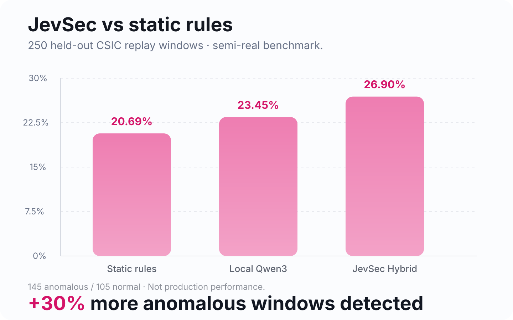

最近一段时间，**Jev** 在 Agent、Guardrail、Eval、Routing 这些方向里出现得越来越频繁。

如果只看名字，很容易把它理解成“又一个更快、更便宜的小模型”。

但真正让我觉得它有意思的地方并不是这个。

Jev 更像是在强调一种和普通 LLM 完全不同的使用方式：

> **不要让模型写一大段话给人看，而是把当前状态交给模型，让它返回程序可以直接使用的结构化判断。**

也就是：

```text
Application State
        ↓
Typed Questions
        ↓
Decision / Score / Probability
        ↓
Code decides what to do
```

这个思路最近在 Agent 领域很容易找到应用。

例如：

- 一个 Agent 下一步要不要调用某个工具；
- 一次 Tool Call 是否风险过高；
- 一段 Tool Result 是否包含 Prompt Injection；
- 当前任务应该路由给哪个模型；
- 一条 Agent Trace 是否值得人工复核；
- 一个动作是 Allow、Ask 还是 Deny。

而我最近在想另一个问题：

> **这种“Decision Model”思路，能不能拿来做 Web 安全？**

于是就有了 **JevSec**。

GitHub：

https://github.com/ccjmcc/jevsec

项目展示页：

https://www.easytool.me/jevsec/



## 先说 Jev 到底和普通 LLM 有什么不同

普通 LLM 最自然的接口是：

```text
Prompt
  ↓
一段自然语言
```

比如你问：

> 这段访问日志有没有问题？

它可能回答：

> “从日志来看，用户在短时间内访问了多个路径，并发生多次登录失败，因此可能存在扫描或暴力破解行为……”

这段话给人看很舒服。

但如果你想把它放进软件系统里，就开始麻烦了。

你真正需要的可能只是：

```json
{
  "should_review": true,
  "category": "auth_anomaly",
  "risk": 0.78
}
```

或者更简单：

```text
ALLOW
REVIEW
BLOCK
```

Jev 这类 Decision Model 的重点就是：

> **让模型的输出从“文本”变成“决策”。**

这也是为什么最近它很适合被接到 Agent Loop 里。

因为 Agent 每一步真正需要的往往不是一篇作文，而是：

```text
这个工具该不该调用？
这个结果可信不可信？
要不要升级到更强模型？
要不要让用户确认？
```

这些本质上都是 decision。

## 为什么我觉得它特别适合安全场景

安全系统里其实到处都是决策问题。

比如：

```text
这个请求要不要拦？
这个 IP 要不要进入观察名单？
这一段行为值不值得人工复核？
这个 Session 是否明显偏离正常行为？
两个弱信号叠加后是否应该升级风险？
```

传统安全系统通常会把这些东西写成规则。

例如：

```text
失败登录 > 5 次
AND
5 分钟内访问 > 20 个路径
THEN
风险 + 30
```

这种规则最大的优势是：

**可控、可解释、稳定。**

但它也有一个很明显的缺点：

> 很多行为很难写成一个简单的 if。

比如：

```text
正常访问
→ 登录失败
→ 再次失败
→ 登录成功
→ 访问以前没访问过的敏感路径
→ 随后出现短时间接口遍历
```

每一个动作单独拿出来，都可能正常。

真正可疑的是：

**这些事情按这个顺序发生了。**

这就很适合 Jev 这种“把一整个 State 交给模型做判断”的思路。

# JevSec 想做的事情

JevSec 不是一个新的 WAF。

我现在甚至越来越不想叫它“AI WAF”。

因为这个说法很容易把方向带偏。

成熟 WAF，例如 OWASP CRS，擅长的是：

```text
单请求
↓
SQLi / XSS / Path Traversal / Command Injection
↓
规则判断
```

而 JevSec 更希望看：

```text
多个请求
↓
顺序 / 频率 / 状态变化 / 路径变化
↓
行为判断
```

所以我的一句话定位现在是：

> **Your WAF sees requests. JevSec sees behavior.**

也就是：

> WAF 看请求，JevSec 看行为。

## JevSec 当前架构

现在整体流程大概是：

```text
Nginx / JSONL
        ↓
Privacy-aware Parser
        ↓
Behavior Window
        ↓
Static Rules + Local Jev / Qwen3-4B
        ↓
Hybrid Decision
        ↓
BENIGN / REVIEW / HIGH_RISK / UNCERTAIN
        ↓
SQLite + Dashboard
```

这里我没有直接把完整 HTTP 请求原封不动丢给模型。

这是我觉得安全 AI 很容易踩的一个坑。

# 本地 Jev + Qwen3-4B

JevSec 当前使用的是本地 Jev 兼容运行层，后端模型固定为：

```text
Qwen3-4B-Instruct-2507
```

我故意没有先上 14B、32B 或更大的云模型。

因为我真正想验证的是：

> **一个普通开发者自己机器上能跑的小模型，到底能不能给安全系统提供有意义的增量？**

而且安全日志本身很敏感。

它里面可能出现 Cookie、Authorization、用户路径、Session、内部接口、请求参数和业务结构。

所以 JevSec 当前会先做 Privacy-aware Normalization。

例如这些内容不会直接作为模型上下文长期保留：

```text
Cookie
Authorization
Password
API Key
未知 JSON 字段
```

Session / User 也会先做伪匿名化。

模型看到的更多是：

```text
request_count
unique_path_count
login_fail_count
auth_state_change
path_novelty
encoding_density
sensitive_path_indicator
burst_pattern
```

也就是说：

> **尽量给模型行为结构，而不是给模型原始秘密。**

# 第一轮真正让我冷静下来的 Benchmark

JevSec 早期其实跑过一些很漂亮的 synthetic benchmark。

但后来我越来越觉得：

> 如果数据也是自己设计的，那模型可能只是在识别“我设计出来的异常”。

于是我加入了 CSIC 2010 HTTP 数据，重新构造了一套半真实 replay benchmark。

当前核心测试：

```text
250 个 held-out Behavior Windows
145 anomalous
105 normal
```

每个窗口 12 requests，一部分异常窗口只混入 1～3 条异常请求。

结果是：

| 方案 | Recall | Precision | Observed FPR | 检出异常 |
|---|---:|---:|---:|---:|
| Static Rules | 20.69% | 100.00% | 0.00% | 30 / 145 |
| Local Jev / Qwen3-4B | 23.45% | 97.14% | 0.95% | 34 / 145 |
| **JevSec Hybrid** | **26.90%** | **97.50%** | **0.95%** | **39 / 145** |

最直观的结果：

```text
Static Rules  30 / 145
Hybrid        39 / 145
```

也就是这一批测试数据里：

> **Hybrid 检出的异常窗口数量相对增加约 30%。**

而正常窗口中 1 / 105 被额外送进了 Review。

如果只看到这里，很容易觉得 Jev 这个方向是不是已经很强了。

但继续往下看，就没这么简单。

# 真正的问题：AUROC 只有 0.454

这次测试里：

```text
Static Rules  AUROC = 0.522
Qwen3-4B      AUROC = 0.473
Hybrid        AUROC = 0.454
```

AUROC 接近 0.5，简单理解就是：

> **这个风险分数还没有很好地把正常和异常排序开。**

也就是说，Hybrid 确实在当前 threshold 下额外捞到了一些异常。

但这并不等于 Jev 已经真正理解了哪些行为更危险。

所以我现在给 JevSec 的定位仍然是：

```text
Research Alpha
Shadow Mode
Human Review
```

而不是 Production Blocking。

# 为什么我还是觉得 Jev 这个方向值得继续做

因为这轮结果虽然不漂亮，但暴露了一个很关键的问题：

> **模型可能不是不够聪明，而是我给它看的 State 不够好。**

现在 JevSec 很多上下文仍然是聚合数字。

例如：

```text
login_failures = 2
unique_paths = 8
request_count = 12
sensitive_path = 1
```

但 Web 行为安全真正重要的东西，很可能是：

**顺序。**

例如：

```text
LOGIN_FAIL
→ LOGIN_FAIL
→ AUTH_SUCCESS
→ NEW_SENSITIVE_PATH
```

和：

```text
AUTH_SUCCESS
→ NORMAL_PATH
→ NORMAL_PATH
→ LOGIN_FAIL
```

统计量可能很像，安全含义完全不一样。

# Jev + Sequence Context 可能才是关键

所以 JevSec 下一步准备做的重点叫：

## Sequence Context

不是继续给 Jev 更多原始日志。

而是把每一条请求先转换成隐私安全的事件符号：

```text
NORMAL_PATH
NEW_PATH
LOGIN_FAIL
AUTH_SUCCESS
SENSITIVE_PATH
HIGH_ENCODING
BURST_ACCESS
ENUMERATION_PATTERN
```

然后给 Jev 的 State 变成：

```text
NORMAL_PATH
→ LOGIN_FAIL
→ LOGIN_FAIL
→ AUTH_SUCCESS
→ NEW_SENSITIVE_PATH
→ BURST_ACCESS
```

这其实非常符合 Jev 的思路：

> **State → Decision**

关键不是 Prompt 写得多长，而是 State 到底有没有把真正重要的信息表达出来。

# Jev 和 Agent 爆火之后，我更关心“决策层”

这两年大家都在做 Agent。

最常见的话题是模型会不会调用工具、能不能自己规划、能不能操作电脑。

但 Agent 真正落地之后，很快会遇到另一堆问题：

```text
它该不该执行这个动作？
这个 Tool Call 安全吗？
这个结果可信吗？
现在该不该让人确认？
这个任务值不值得升级到更贵的模型？
```

这些问题其实都不是“生成”。

而是：

**判断。**

我觉得 Jev 这波值得关注的地方就在这里：

> 当 Agent 开始真正执行动作以后，“Decision Model”可能会成为很重要的一层基础设施。

而 JevSec 只是我把这个思路放到 Web 安全里的一个实验。

# JevSec 现在到了哪一步

目前已经有：

```text
Local Qwen3-4B
Behavior Window
Static Rules
Hybrid Decision
Nginx / JSONL ingestion
Shadow Mode
Dashboard
SQLite
Docker
Benchmark
OWASP CRS comparison
Failure Analysis
Privacy Design
Threat Model
CI
```

全部开源：

https://github.com/ccjmcc/jevsec

项目展示：

https://www.easytool.me/jevsec/

# 最后

我现在越来越觉得，Jev 最值得研究的问题不是：

> **它是不是一个比 LLM 更便宜的新模型？**

而是：

> **我们是不是一直在用生成式模型，解决其实只需要结构化判断的问题？**

如果一个任务真正需要的是：

```text
yes / no
A / B / C
0～1 risk
allow / review / deny
```

那么让模型输出一整段自然语言，本身可能就是绕远路。

JevSec 目前的数据还远远谈不上证明这个方向成功。

Hybrid AUROC 只有 0.454，真实生产环境也还没有完成充分验证。

但至少它让我开始认真思考一个问题：

> **当 AI 从“聊天”走向“执行”，真正缺的也许不是更多会说话的模型，而是更可靠的决策层。**

而 Jev，可能正好踩在这个方向上。

---

## 参考与说明

- Jev 的公开介绍强调将 application state 转换为程序可消费的 typed decisions。
- Jev 相关生态已经出现 Agent Eval、Guardrail、Tool Risk Scoring、Routing 等方向的实践。
- JevSec 的 Benchmark、WAF 对比、失败分析与 Roadmap 均已公开在 GitHub 仓库中。
- 本文中的 JevSec 指我自己的开源实验项目；文中提到的 Jev 生态项目并不代表它们与 JevSec 存在官方合作或背书关系。
